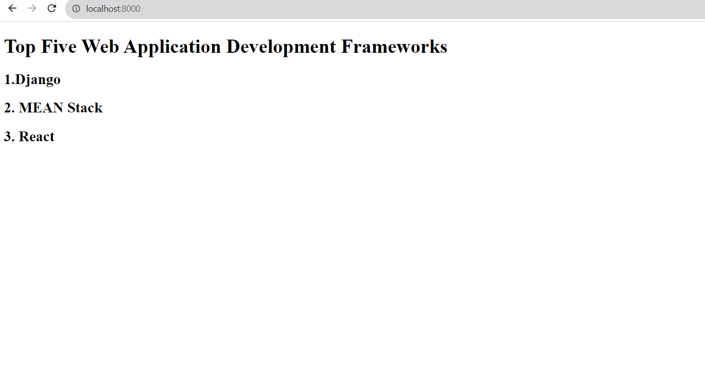
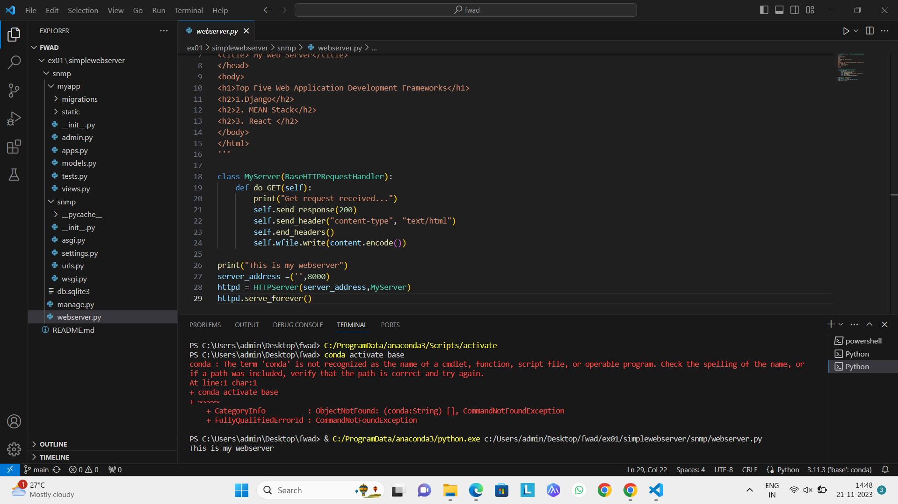

# EX01 Developing a Simple Webserver
## Date:

## AIM:
To develop a simple webserver to serve html pages.

## DESIGN STEPS:
### Step 1: 
HTML content creation.

### Step 2:
Design of webserver workflow.

### Step 3:
Implementation using Python code.

### Step 4:
Serving the HTML pages.

### Step 5:
Testing the webserver.

## PROGRAM:
```
from http.server import HTTPServer,BaseHTTPRequestHandler

content='''
<!doctype html>
<html>
<head>
<title> My Web Server</title>
</head>
<body>
<h1>Top Five Web Application Development Frameworks</h1>
<h2>1.Django</h2>
<h2>2. MEAN Stack</h2>
<h2>3. React </h2>
</body>
</html>
'''

class MyServer(BaseHTTPRequestHandler):
    def do_GET(self):
        print("Get request received...")
        self.send_response(200) 
        self.send_header("content-type", "text/html")       
        self.end_headers()
        self.wfile.write(content.encode())

print("This is my webserver") 
server_address =('',80)
httpd = HTTPServer(server_address,MyServer)
httpd.serve_forever()
```

## OUTPUT:
## serveroutput


## clientoutput



## RESULT:
The program for implementing simple webserver is executed successfully.
